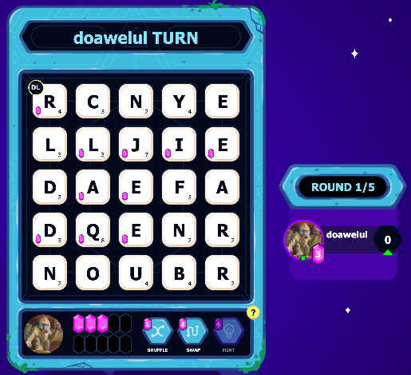

## Inspiration

Discord users worldwide have been enjoying activities (in-client multiplayer games) since their release in 2023. One of the most popular games is Spellcast, a spelling game similar to words with friends. The community based wiki page for it is [here on Fandom](https://discord.fandom.com/wiki/SpellCast). The most interesting mode is 2v2, where the gem mechanic makes strategic word finding more important than raw point maximization. Though there are other online solvers, none are easy to use, take into account multi-round strategy using gems, or are even documented well enough to trust their accuracy. Virtually all require painstakingly, entering every letter in the grid, which is simply infeasible in a timed game. I therefore thought that it would be great to practice my neural network design skills to not only create scripts to parse and understand board states quickly, but also to explore cutting edge reinforcement learning concepts to play the game strategically.

## What this is?

This is a collection of python scripts that parse Spellcast and find the optimal strategy on the current board state. There is also an abstract clone of the game to train the reinforcement learning algorithm. Research was done to find the exact dictionary the game uses. Neural networks are custom designed, trained, and used for non-trivial tasks. CNNs are used for parsing the game state, while a DQN is implemented for a strategy engine. The naive full search point maximization solution is provided as well.

## How do I use this?

Screenshot the board state and save it as `test.png`. Run the relevant script `python find_move.py`. Read the output and enter it into the game. Screenshots should be similarly sized to this demo photo, though slight deviations are still parsable:

---

Jul 2 2025: The game has recently been removed from discord activities and the frvr site. Therefore, this project is on hold. If the game is ever re-released, the primary next steps are to wrap up the game logic engine and polish the letter recognition CNN.
